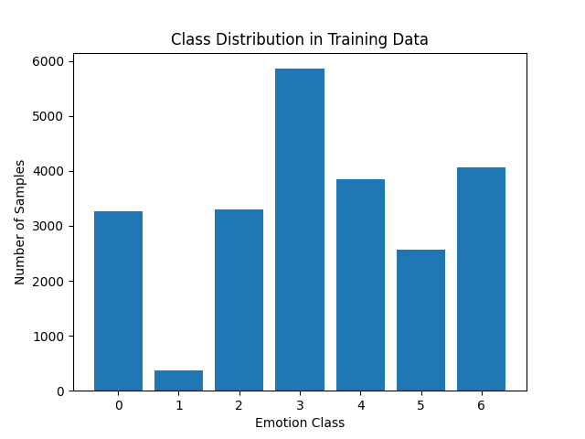
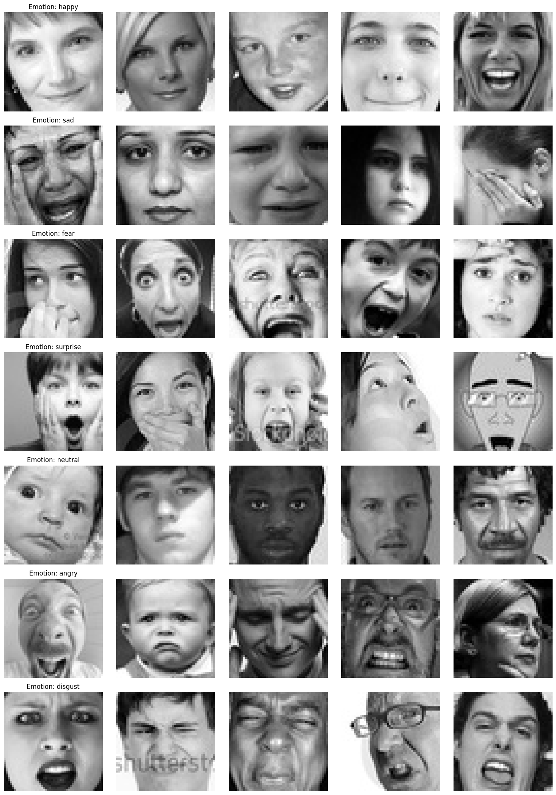
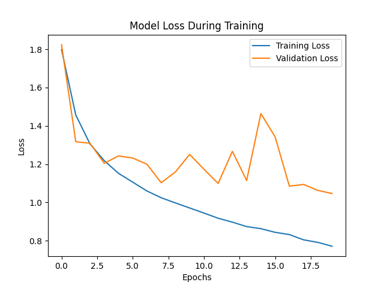
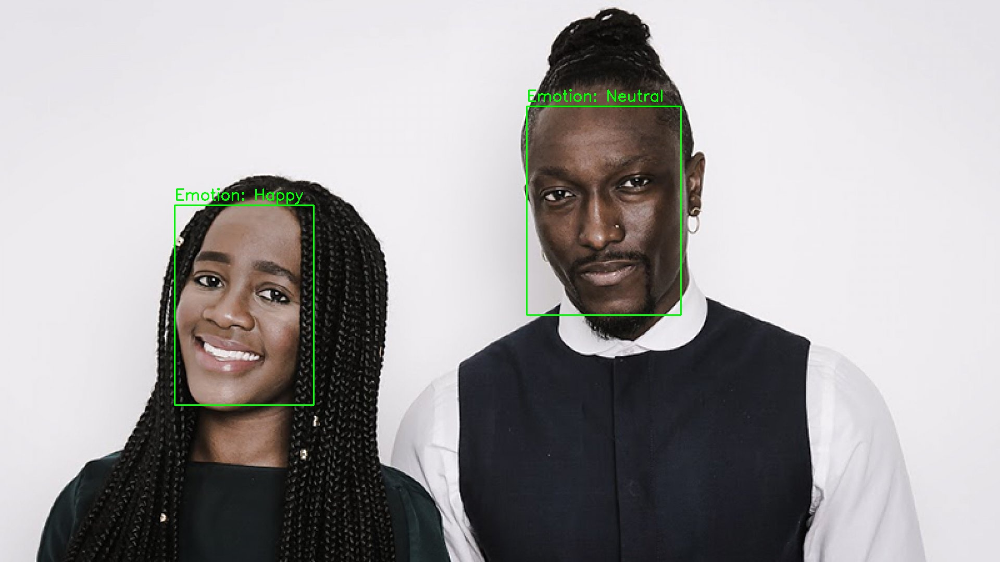

# **Facial Emotion Detection**

## **Table of Contents**
1. [Introduction](#introduction)
2. [Dataset](#dataset)
3. [Project Overview](#project-overview)
4. [Dataset Exploration and Preprocessing](#dataset-exploration-and-preprocessing)
5. [Model Development](#model-development)
6. [Training and Model Evaluation](#training-and-model-evaluation)
7. [Real-Time Emotion Detection](#real-time-emotion-detection)
8. [Emotion Detection from Static Images](#emotion-detection-from-static-images)
9. [Conclusion](#conclusion)

## **Introduction**
This project involves building a model that recognizes human emotions based on facial images. The model is trained using the FER2013 dataset, which contains grayscale images of faces categorized into seven emotion labels: Angry, Disgust, Fear, Happy, Sad, Surprise, and Neutral.

The model is developed using Convolutional Neural Networks (CNNs) and is capable of detecting emotions both in real-time video streams and in static images.

## **Dataset**
The dataset used for training the model is the FER2013 dataset. It contains 48x48 pixel grayscale images, each classified into one of seven emotions. The dataset is split into training and test sets, with the training set used to train the model and the test set used for evaluation.
- Training set: 28,709 images
- Test set: 7,178 images

**Note:** The files `archive (7).zip`, `processed/test_images.npy`, and `processed/train_images.npy` were not uploaded to this repository due to GitHub's file size upload limitations.

## **Project Overview**
The project is divided into the following key phases:
1. Dataset Exploration and Preprocessing
2. Model Development
3. Training and Model Evaluation
4. Real-Time Emotion Detection
5. Emotion Detection from Static Images

## **Dataset Exploration and Preprocessing**

### Class Distribution
The datasets exhibit a class imbalance.


### Dataset Exploration
The dataset contains grayscale images of faces labeled with one of the seven emotions.

Sample image from the training set


### Preprocessing
Preprocessing involved resizing the images to the required input shape (48x48), normalizing pixel values, and converting emotion labels into numeric form. Additionally, the training data was split into training and validation sets.

**Emotion Mapping**
Each emotion was mapped to a numeric label for model training:

- Angry: 0
- Disgust: 1
- Fear: 2
- Happy: 3
- Sad: 4
- Surprise: 5
- Neutral: 6

**Preprocessing Steps**
- Resized images to 48x48 pixels
- Converted images to grayscale
- Normalized pixel values to range [0, 1]
- Split the training data into training (90%) and validation (10%) sets.

## **Model Development**
A Convolutional Neural Network (CNN) was built to classify the facial images into the seven emotion categories. The CNN architecture consists of multiple convolutional layers followed by pooling layers, batch normalization, and fully connected layers.

### CNN Architecture
- **Conv2D layers:** Learn features from the images
- **MaxPooling2D layers:** Reduce spatial dimensions
- **BatchNormalization:** Speed up training and stabilize the model
- **GlobalAveragePooling2D:** Reduces the dimensionality for efficient learning
- **Dense layers:** Perform final classification

### Data Augmentation
To improve model generalization, a data augmentation techniques like rotations, shifts, zoom, and flips was applied.

### Oversampling
Since the dataset was imbalanced, oversampling was applied to handle class imbalance.

## **Training and Model Evaluation**
- A model was trained using the augmented and resampled data, `sparse_categorical_crossentropy` loss and the Adam optimizer with early stopping to prevent overfitting.
- **Loss:** The model achieved a reasonable loss for the validation data, and the early stopping mechanism helped to prevent overfitting.
- The model was saved.



- After training the model, it was evaluated on the test set to assess its performance.
    - **Accuracy Achieved:** ~62%

## **Real-Time Emotion Detection**
A script (`real_time_emotion_detection.py`) was developed, which allows emotion detection directly from a live video stream using a webcam. The script captures video frames in real-time, detects faces using OpenCV and mtcnn, and applies the trained facial emotion detection model to classify the emotions.

Once executed, the system will display the video feed with bounding boxes around detected faces, and the predicted emotion (e.g., Angry, Happy, Sad, etc.) will be shown above each face in real-time.

**How to Run:**
To launch real-time emotion detection via your webcam, navigate into the `scripts` directory and use the following command in the terminal:
```bash
python real_time_emotion_detection.py
```
After running the command, the webcam will be activated, and emotion detection will commence in real-time. The system will keep running until manually stopped (e.g., by pressing `q` keyword or `Ctrl+C`).

## **Emotion Detection from Static Images**
A script (`emotion_detection.py`) was also designed to detect emotions from static image files. This is useful when performing emotion classification on pre-existing images rather than using a live video stream.

Upon execution, the script takes the input image, preprocesses it by resizing and normalizing the image, and applies the model to predict the emotion present in the face. The output will display the image along with the corresponding emotion label.

Again, an emotion frequecy count is displayed in a `csv` file.

**How to Run:**
To detect emotions in a static image, navigate to the `scripts` directory and execute the following command in the terminal:
```bash
python emotion_detection.py --image <path_to_image> --output_image <path_to_output_image> --output_csv <path_to_output_csv>
```
- Replace `<path_to_image>` with the file path of the image you wish to analyze.
- Replace `<path_to_output_image>` with the path where you want to save the annotated image.
- Replace `<path_to_output_csv>` with the path where you want to save the emotion frequency CSV file.

**Sample Output**


[Image Reference](https://www.inc.com/sarah-jackson/30-under-30-2018-tonl.html)

## **Conclusion**

The Facial Emotion Detection project demonstrates a comprehensive approach to emotion recognition using computer vision and deep learning. By integrating MTCNN for face detection and a Convolutional Neural Network (CNN) for emotion classification, the project achieves accurate and real-time emotion analysis. The ability to process both static images and live video streams provides flexibility and practical applications across various domains.
